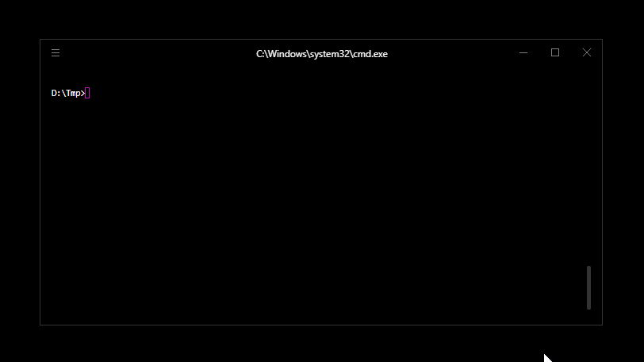

# Exe2jar

This tool is a unpacker for Jar2Exe Windows executables

Jar2exe is a wrapper cross platform for JAR files that allows the execution of JAR files through a windows, linux or mac executable while the JRE is installed.

My unpacker recover the main JAR file from these executable

http://www.jar2exe.com/features

NOTE : This was a little school project with the goal to make a Java program that use Object programming.



## Why java ?

Again the goal of this project was to make a Java program, so I tried to make something useful

## Warning

**This type of wrapper are used to hide malware, and my objective with this project is to help and simplify the analysis and the reverse of this type of executable.**

**I have created this tool ONLY for EDUCATIONAL PURPOSES. This could be maliciously used and it's why I DO NOT GUARANTEE AND IS RESPONSIBLE, in no case, of such use.**

**You are responsible of your actions towards this program.**

## Usage

```
Usages : Exe2Jar.jar <option> <file>
         -h                     : Show usages
         -i <file>              : Show informations about the executable
         -u <outputFile> <file> : Unpack the jar file from the executable
```

## Support

**Options :**

- No options
- Hide

**Info :**

- Gui 32 bit
- Gui 64 bit
- Console 32 bit
- Console 64 bit

**Unpack :**

- Gui 32 bit
- Gui 64 bit
- Console 32 bit
- Console 64 bit
- Services 32 bit
- Services 64 bit

## TODO

- Encrypt (Coming Soon)

## License
[Creative Commons Attribution-NonCommercial-NoDerivatives](http://creativecommons.org/licenses/by-nc-nd/4.0/)
